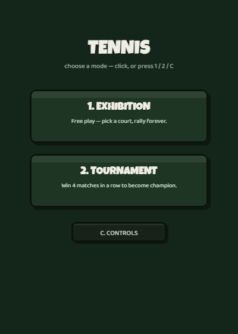
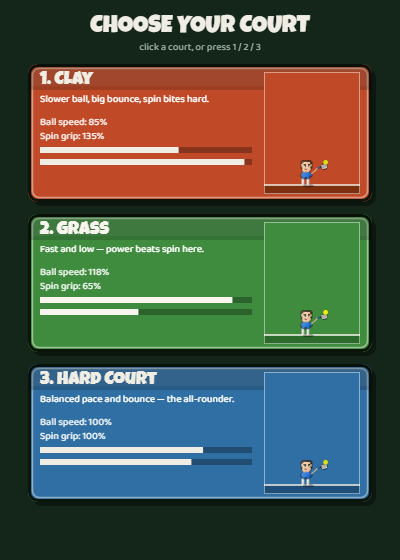
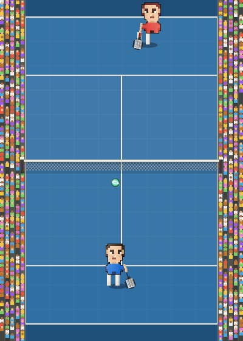

# Tennis

A 2D top-down tennis game built with plain HTML5 Canvas and vanilla JavaScript — no frameworks, no build step, no dependencies. Everything runs from three files.

## Play it

[**Live demo**](#) *(link goes here once deployed — see below)*

Or run it locally: clone the repo and open `index.html` in a browser (Chrome/Edge/Firefox all work).

## Features

- **Physics-based rallies** — shot speed, spin/slice curve, and bounce behavior all scale together, with a hard cap on the ball's real resultant speed so nothing (a power shot near the net on a fast surface, for example) can exceed it.
- **3 court surfaces** (Clay / Grass / Hard Court), each with its own speed and spin multipliers and a ball color palette tuned so the ball stays visible against that surface.
- **4 racket loadouts** (All-Court / Power / Control / Spin) — a pre-match equipment choice that trades speed, power, spin, and reach against each other; no loadout is a strict upgrade over the default.
- **Serve aiming and timing** — steer a crosshair inside the service box and time a moving bar; hitting a corner narrows the timing window but rewards a faster, harder-to-return serve.
- **Lobs and drop shots** with their own flight arcs, plus net-rushing AI that's physically locked out of the net until it's earned the position by winning enough of the rally.
- **Tournament mode** — a 4-round bracket against opponents with distinct, hand-tuned playstyles (footspeed, serve aggression, shot selection, how eagerly they approach the net), not just a difficulty slider.
- **Custom pixel-art characters**, drawn procedurally on canvas — animated legs and swinging arms, cel-shaded lighting, and a sprite outline pass — rather than static image assets.
- **Synthesized audio** — every sound (racket hits, crowd reactions) is generated on the fly with the Web Audio API. No audio files.

## Screenshots

| Court select | Mid-rally |
|---|---|
|  |  |

## Controls

| Key | Action |
|---|---|
| Arrow keys / WASD | Move |
| Space | Serve / confirm |
| X | Power shot |
| Z | Slice |
| V | Lob / drop shot |
| Esc | Pause |
| C | Controls overlay |

## Tech

Vanilla JavaScript, the Canvas 2D API, and the Web Audio API. No build tooling, no external libraries — `index.html`, `style.css`, and `script.js` are the entire project.

## Status

Actively developed as a personal project.
